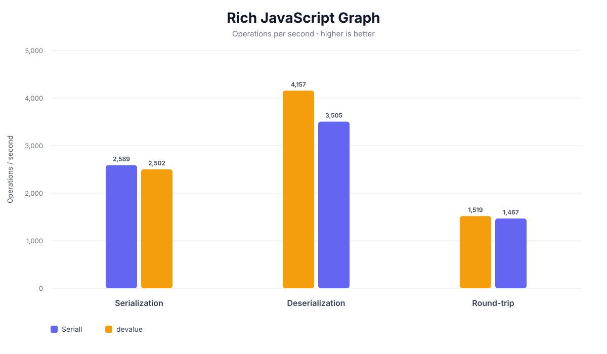

# seriall

## TL;DR

**seriall is a data-only serialization protocol for JavaScript object graphs, preserving reference identity, circular structures, built-in types, and registered custom classes.**

**The only JavaScript values not supported out-of-the-box are:**

- ⚠️ Custom classes instances with **JavaScript private fields** (`#field`),

  there are still configurable workarounds, just no out-of-the-box solution

  typescript `private` visibility is generally supported ✅

- 🚫 Any **function / whole class**, for security reasons (e.g: `serialize(MyClass)` or `serialize(myFunction)`)

  even though even this is theoretically configurable

seriall **does not use `eval` or dynamically execute serialized JavaScript code**. Serialized functions and classes are not supported by default, which helps keep deserialization data-only.

It **conserves refenrential integrity**, so circularly referenced arrays/objects, and cross referenced arrays/objects can be serialized

It **can out-of-the-box register custom classes**, and recreates their instances at deserialization time

It is **highly configurable**, through the usage of `transformers`

## Table of Contents

- [TL;DR](#tldr)
- [Installation](#installation)
- [Usage](#usage)
  - [Basic usage](#basic-usage)
  - [Registering custom classes](#registering-custom-classes)
- [Supported](#supported)
- [Advanced Usages](#advanced-usages)
  - [Symbols](#symbols)
  - [Transformers](#transformers)
  - [Custom Class Serialization](#custom-class-serialization)
  - [Prototype Preservation](#prototype-preservation)
  - [Data Descriptor Preservation](#data-descriptor-preservation)
- [Benchmark](#benchmark)
- [Import Notes](#import-notes)
  - [JavaScript](#javascript)
  - [Typescript](#typescript)
- [Protocol Versioning](#protocol-versioning)
  - [Motive](#motive)
  - [Solution](#solution)
  - [Stable top-level structure](#stable-top-level-structure)

## Installation

Inside an npm project: `npm install seriall` or `yarn install seriall`

## Usage

### Basic usage

```ts
// example.ts

import { Serializer } from "seriall";

const { serialize, deserialize } = new Serializer();

// ------- create test data -------

const nested = { name: "Gömböc" };

const myData: any = {
  nestedObjects: [nested, nested],
  name: "It works!",
};

myData.self = myData;

// ------- serialize data -------

const str = serialize(myData);
//    ^^^
// {"lib":"seriall","v":1,"d":[{"nestedObjects":1,"name":4,"self":0},[2,2],{"name":3},"Gömböc","It works!"]}

// -------  -------  -------
// `str` can now go through a network for instance, and be deserialized at the other end like so:
// -------  -------  -------

const revivedData = deserialize(str);

console.log(revivedData.self === revivedData);
// true
console.log(revivedData.nestedObjects[0] === revivedData.nestedObjects[1]);
// true
console.log(revivedData.nestedObjects[0]);
// {name: "Gömböc"}
console.log(revivedData.name);
// It works!
```

### Registering custom classes

```ts
// example.ts

import { Serializer, SerializableClass } from "seriall";

// ------- create a new serializer -------

const serializer = new Serializer();

// ------- create and register custom classes -------

class Address extends SerializableClass {
  country: string;
  city: string;
  constructor(country: string, city: string) {
    super();
    this.country = country;
    this.city = city;
  }

  getFullAddress() {
    return `${this.city}, ${this.country}`;
  }
}

serializer.registerClass("adr", Address);

class User extends SerializableClass {
  name: string;
  friends: User[] = [];
  address: Address | undefined;
  constructor(name: string) {
    super();
    this.name = name;
  }
}

serializer.registerClass("usr", User);

// ------- create test data -------

const mary = new User("Mary");
const john = new User("John");
const paris = new Address("France", "Paris");

mary.address = paris;
john.address = paris;
mary.friends.push(john);
john.friends.push(mary);

const str = serializer.serialize(mary);
//    ^^^
// {"lib":"seriall","v":1,"d":[["$usr",1,2,6],"Mary",[3],["$usr",4,5,6],"John",[0],["$adr",7,8],"France","Paris"]}

// -------  -------  -------
// `str` can now go through a network for instance, and be deserialized at the other end like so:
// -------  -------  -------

const revived = serializer.deserialize(str);

console.log(revived.name);
// mary
console.log(revived.address.getFullAddress());
// Paris, France
console.log(revived.friends[0].name);
// john
console.log(revived.friends[0].friends[0] === revived);
// true
console.log(revived.address === revived.friends[0].address);
// true
```

## Supported

As mentionned earlyer, seriall supports any graph data (objects or arrays), while preserving referential integrity

It also natively support any non-json-primitives:

- `undefined`, `null`, `Infinity`, `-Infinity`, `-0`, `NaN`

as well as JS-specific data-types:

- `Symbols`, `BigInts`

native classes instances

- `Date`, `RegExp`, `Set`, `Map`

and boxed primitives

- `String`, `Number`, `Boolean`

## Advanced Usages

### Symbols

By default, seriall ignores symbol keys in objects, for performance reasons.
You can however enable this feature in the Serializer's options

```ts
import { Serializer } from "seriall";

const serializer = new Serializer({ enable: { objectSymbolIndexing: true } });
//                                                                  ^^^^
//                                                                  false by default

const secretKey = Symbol("secret");

const data = {
  [secretKey]: "Hello from a symbol key!",
};

const serialized = serializer.serialize(data);
const deserialized = serializer.deserialize(serialized);

const restoredKey = Object.getOwnPropertySymbols(deserialized)[0];

console.log(deserialized[restoredKey]);
// "Hello from a symbol key!"

console.log(restoredKey.description);
// "secret"
```

Symbol identity is also preserved across references:

```ts
const key = Symbol("key");

const data = {
  [key]: "value",
  key,
};

const restored = serializer.deserialize(serializer.serialize(data));

const restoredKey = Object.getOwnPropertySymbols(restored)[0];

console.log(restored[restoredKey]);
// "value"

console.log(restored.key === restoredKey);
// true
```

This works because seriall preserves the object graph, rather than simply converting values to JSON.

### Transformers

seriall's serialization logic is built around **transformers**.

A transformer tells seriall how to:

- identify a specific type of value
- encode it into serializable data (always an array for performance reasons)
- decode that data back into the original type

This makes seriall highly configurable and allows it to support types that are not supported out-of-the-box.

A transformer can be registered using `registerTransformer()`:

```ts
import { Serializer, Transformer } from "seriall";

const serializer = new Serializer();

const transformer = new Transformer({
  id: "url",
  priority: Transformer.PRIORITY.CUSTOM_CLASS,
  match: (value) => value instanceof URL,
  encode: (value) => [value.toString()],
  decode: ([value]) => new URL(value),
});

serializer.registerTransformer(transformer);

const original = {
  website: new URL("https://example.com"),
};

const serialized = serializer.serialize(original);
const restored = serializer.deserialize(serialized);

console.log(restored.website instanceof URL);
// true

console.log(restored.website.href);
// "https://example.com/"
```

### Custom Class Serialization

The `registerClass()` mechanism introduced earlier is actually built on top of seriall's transformer system.

In other words, **a registered class is ultimately just a transformer**.

This means that the class serialization mechanism can be reproduced and customized using `Transformer` directly when more control is needed.

By default, `SerializableClass` provides the necessary encoding and decoding behavior.

Under the hood, it looks something like:

```ts
import { SYMBOLS } from "seriall";

export abstract class SerializableClass {
  [ENCODE]() {...};
  static [DECODE] = function (this, registerNode) {...};
};
```

So you can actually overwrite a class encoding/decoding methods like this:

```ts
import { SerializableClass, SYMBOLS } from "seriall";

class MyClass extends SerializableClass {
  [SYMBOLS.ENCODE]() {
    console.log("Calling a custom encoding function");
    return super[SYMBOLS.ENCODE]();
  }
  static [SYMBOLS.DECODE] = function (this, registerNode) {
    console.log("Calling a custom decoding function");
    return super[SYMBOLS.DECODE](registerNode);
  };
}
```

### Prototype Preservation

By default, Seriall serializes objects as data containers without preserving their prototype chains. This keeps the serialized representation simple and makes deserialized objects safe to use as data containers.

If you need to preserve the prototype structure of your objects, you can enable prototype preservation:

```ts
const serializer = new Serializer({
  enable: {
    preservePrototype: true,
  },
});
```

When enabled, Seriall represents an object's prototype as another node in the serialization graph. This means prototype relationships are preserved by reference, just like any other object relationship.

Prototype preservation also maintains **referential integrity**. If multiple objects share the same prototype, they will continue to share the same revived prototype after deserialization. Cyclic references are also supported by the graph-based serializer.

The object's own string and symbol properties are serialized. Property descriptors are not currently preserved; serialized properties are restored as normal writable, enumerable, and configurable properties.

> **Note:** Prototype preservation is intended for cases where an object's prototype is meaningful to the data being serialized. If objects are primarily being used as dictionaries, leaving this option disabled is generally preferable.

### Data Descriptor Preservation

By default, seriall serializes an object's property values without preserving their property descriptors. This means properties are recreated as regular writable, enumerable, and configurable properties.

If you need to preserve **data property descriptors**, enable `preserveDataDescriptors`:

```ts
const serializer = new Serializer({
  enable: {
    preserveDataDescriptors: true,
  },
});
```

For example:

```ts
const object = {};

Object.defineProperty(object, "value", {
  value: 42,
  enumerable: false,
  writable: false,
  configurable: false,
});

const revived = serializer.deserialize(serializer.serialize(object));

Object.getOwnPropertyDescriptor(revived, "value");
// {
//   value: 42,
//   enumerable: false,
//   writable: false,
//   configurable: false
// }
```

Property keys are serialized as graph values, so symbol keys are also supported when this mode is enabled:

```ts
const key = Symbol("key");

const object = {
  [key]: 42,
};

const revived = serializer.deserialize(serializer.serialize(object));

const revivedKey = Object.getOwnPropertySymbols(revived)[0];

revived[revivedKey];
// 42
```

Because symbols are represented as graph nodes, multiple references to the same symbol retain their referential identity after deserialization.

preserveDataDescriptors currently preserves data descriptors (value, writable, enumerable, and configurable). Accessor descriptors (get / set) are not preserved by this transformer.

This option is disabled by default.

## Benchmark

seriall is designed for **general-purpose JavaScript object graphs**, including circular references, shared references, built-in types, and recursive custom class instances.

Benchmarks were run with **5,000 iterations**, **500 warmup iterations**, and **7 rounds** with randomized benchmark order. Results below use the median of the rounds.

### Common JavaScript graph

This benchmark contains circular references and many shared object references.

| Operation       |          seriall |     V8 | devalue | flatted | superjson |
| --------------- | ---------------: | -----: | ------: | ------: | --------: |
| Serialization   | **16,887 ops/s** | 34,903 |   9,674 |   7,086 |     2,727 |
| Deserialization | **16,077 ops/s** | 18,274 |  16,459 |   3,298 |     6,200 |
| Round-trip      |  **8,279 ops/s** | 11,727 |   5,974 |   2,218 |     1,875 |

seriall 's serialized size was **6,057 bytes**, compared with 6,029 bytes for devalue, 6,445 bytes for flatted, 15,233 bytes for superjson, and 4,458 bytes for V8.

For this graph, seriall 's complete round-trip was approximately **1.4× faster than devalue** and **3.7× faster than flatted**.

### Rich JavaScript graph

The rich graph includes:

- `Date`, `Map`, `Set`, and `BigInt`
- shared references
- circular references
- recursive custom `User` instances
- users referencing themselves and each other
- custom classes nested at multiple levels

| Operation       |         seriall | devalue |
| --------------- | --------------: | ------: |
| Serialization   | **2,589 ops/s** |   2,502 |
| Deserialization | **3,505 ops/s** |   4,157 |
| Round-trip      | **1,467 ops/s** |   1,519 |

seriall serialized this graph to **16,517 bytes**.

The most important difference in this benchmark is correctness: seriall preserves recursive custom-class identity, including self-references and cross-references between class instances.

```text
seriall:
  Self referencing user: PASS
  Cross referencing users: PASS

devalue:
  Self referencing user: FAIL
  Cross referencing users: FAIL
```

### Plots




### Conclusion

In these benchmarks, seriall was the fastest of the tested non-Node.js-only serializers on the common graph, while remaining competitive with devalue on the richer graph.

More importantly, Seriall combines this performance with full referential integrity for recursive custom class instances, configurable transformers, built-in type support, and a data-only serialization format.

That makes Seriall particularly well suited for transferring complex JavaScript object graphs, such as those encountered in network-layer protocols.

## Import Notes

seriall is exported in both cjs and mjs.

It therefore supports both CommonJS import (`require`) and ES Module import (`import`)

It also exposes both `.d.cts` and `.d.mts` declaration files, and provides therefore type-safety in both environment.

### JavaScript

**ES Module**

```ts
// demo.mjs
import { Serializer } from "seriall";
```

**CommonJS**

```ts
// demo.cjs
const { Serializer } = require("seriall");
```

### Typescript

**ES Module**

```ts
// demo.mts
import { Serializer } from "seriall";
// Serializer is properly typed
```

**CommonJS**

either

```ts
// demo.cts
import seriall = require("seriall");
const { Serializer } = seriall;
// Serializer is now typed properly
```

or

```ts
// demo.cts
const { Serializer } = require("seriall") as typeof import("seriall");
// Serializer is now typed properly
```

## Protocol Versioning

### Motive

In the advent of a **breaking protocol change**, serializers running on different platforms (e.g client vs server) could
go temporarily out of sync regarding their serialization protocol.

### Solution

To handle this case and prevent incompatible data from being deserialized incorrectly, **seriall checks the protocol version before deserializing data** .

⚠️ A protocol mismatch will result in a error being thrown

The protocol is however **not expected to change**, and especially not frequently.

### Stable top level structure:

every serialized data consist of a json string, structured like this:

```ts
{
  "lib": "seriall", // stable
  "v": number, // protocol version
  "d": any // serialized data
}
```

- `lib` identifies the serialization format and is expected to remain stable.

- `v` identifies the protocol version and may change if a breaking protocol change is introduced.

- `d` contains the serialized object graph and may change format between protocol versions.
